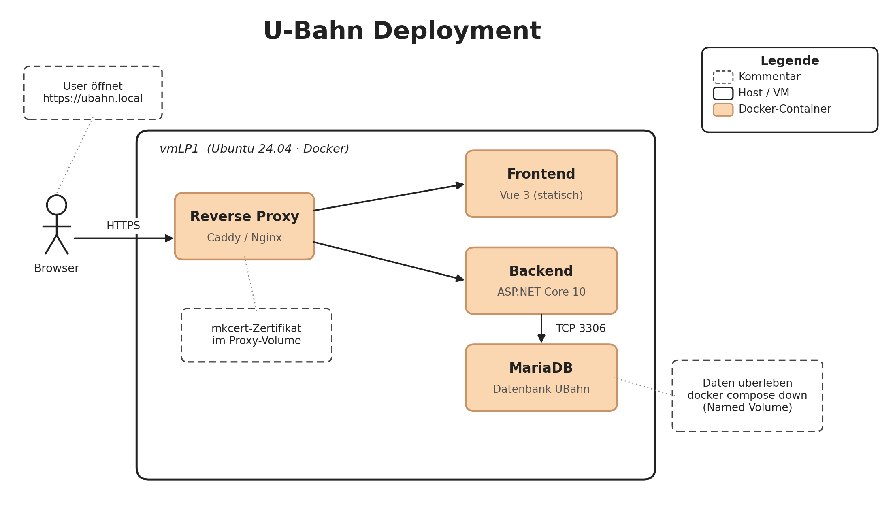

Ausgangslage
Ausgangslage
Du deployst die U-Bahn-Anwendung auf einen lokalen Server. Frontend und Backend kommen aus den Modulen WEB2 und PRG2. Deine Aufgabe ist, beide Anwendungen zu containerisieren und sie zusammen mit der Datenbank und einem Reverse Proxy zu einem produktionsnahen Stack zusammenzubauen.

 

Bewertet wird das Deployment, nicht der Inhalt der Anwendung.

Arbeitsumgebung
Gearbeitet wird auf der virtuellen Maschine vmLP1. Die VM ist ein Ubuntu Client 24.04 mit Internet-Zugang. Die Bewertung erfolgt am Ende der Prüfungszeit direkt auf dieser VM. Was dort nicht startet, kann nicht bewertet werden. Du kannst bei Bedarf weitere Pakete oder Container-Images nachinstallieren.

 

Vorbereitete Werkzeuge

Bereich	Komponenten
Container	Docker Engine, Docker Compose Plugin
Lokale CA	mkcert (mkcert -install bereits ausgeführt, lokale Root-CA im System-Trust)
Sprachen	Node.js 24 LTS und npm, .NET 10 SDK
Tooling	git, curl, jq, rsync, vim, nano, htop, unzip
DNS	Eintrag 127.0.0.1 ubahn.local in /etc/hosts
Internet	voller Zugang zu Docker Hub, NuGet, npm-Registry, GitHub, apt
Was nicht in der Tabelle steht, ist nicht installiert. Du holst es bei Bedarf selbst nach.

Quellen für Frontend und Backend
Du arbeitest primär mit deinem eigenen Frontend (WEB2) und Backend (PRG2):

Frontend/ – Vue 3.5-Anwendung mit Vite
Backend/ – ASP.NET Core 10-API mit Entity Framework Core und MariaDB-Treiber
Fallback-Anwendung

Sollte dein eigener Code nicht lauffähig sein, steht auf dem vmLP1 unter /home/vmadmin/Schreibtisch/Fallback eine Fallback-Anwendung bereit. Es handelt sich dabei um eine schlanke Bahnhofs-Abfahrtstafel, die unabhängig vom U-Bahn-Fallbeispiel funktioniert. Die Fallback-Quellen sind funktional, jedoch nicht containerisiert, die Containerisierung ist Teil deiner Aufgabe.

 

Verwendungsregeln

Standardmässig verwendest du immer deinen eigenen Code aus der SDP (PRG2/WEB2). Das Fallback-Frontend bzw. -Backend setzt du ausschliesslich dann ein, wenn dein eigenes Frontend und/oder Backend aus der Prüfung nicht funktioniert. Die Nutzung der Fallback-Ressourcen trotz funktionierendem eigenem Code führt zu Punktabzug. Deine Wahl ist inklusive Begründung in der Dokumentation festzuhalten.

Werkzeug-Wahl
Die Anwendung wird als Multi-Container-Setup mit docker compose deployed. Welche Tools du innerhalb des Stacks einsetzt, entscheidest du selbst, solange die Anforderungen erfüllt sind:

 

Reverse Proxy: Caddy, Nginx, Traefik oder eine vergleichbare Lösung deiner Wahl
Datenbank: MariaDB
Frontend-Auslieferung: ein statischer Build, ausgeliefert über einen einfachen statischen File-Server im Container
HTTPS: Pflicht, mkcert ist installiert, das Zertifikat für ubahn.local erzeugst du selbst
Den Rest entscheidest du eigenständig: Aufbau der Dockerfiles, Volumes, Netzwerke, Healthchecks, Service-Namen. Diese Entscheidungen begründest du in einem kurzen begleitenden Dokument.

Architektur
Der Zielzustand: ein Reverse Proxy nimmt HTTPS-Anfragen entgegen und verteilt sie auf Frontend und Backend. Das Backend spricht mit der Datenbank. Nur der Proxy ist von aussen erreichbar.

Was am Ende der Prüfungszeit funktionieren soll
Nach docker compose up -d aus deinem Abgabeverzeichnis ist Folgendes der Fall:

Im Browser öffnet sich https://ubahn.local mit einem gültigen lokalen Zertifikat
Die Seite zeigt die Inhalte der Anwendung mit Daten aus der Datenbank
docker compose ps zeigt alle Services im Zustand healthy
Ein zweimaliges Ausführen von docker compose down und docker compose up -d reproduziert den Stack ohne Datenverlust

Anforderungen
Die folgenden Anforderungen sind verbindlich. Wie du sie konkret umsetzt, entscheidest du selbst und hältst die wichtigsten Entscheidungen in der begleitenden Dokumentation fest.

 

Containerisierung

 

Eigene Dockerfiles für Frontend und Backend, je als Multi-Stage-Build
Mindestens ein Container läuft als Non-Root-User
.dockerignore vorhanden
Compose-Stack

Vier Services in einem internen Netzwerk, gesteuert über docker-compose.yml

 

Services: Frontend, Backend, MariaDB, Reverse Proxy
Service-Discovery via Container-Namen (kein localhost)
Nur der Reverse Proxy publisht Ports nach aussen
depends_on mit condition: service_healthy für kritische Abhängigkeiten
Reverse Proxy und HTTPS

Routing-Schema entscheidest du selbst und dokumentierst es

 

HTTPS-Terminierung unter https://ubahn.local
Zertifikat aus der lokalen mkcert-CA
Routing trennt Frontend- und Backend-Anfragen
Persistenz und Konfiguration

Named Volume für die MariaDB-Daten
Konfiguration über .env-Datei und environment-Block
.env.example liegt der Abgabe bei
Healthchecks

Backend stellt /health-Endpoint bereit
Compose-Healthchecks für Backend und MariaDB
Container-Logs landen auf stdout
Begleitende Dokumentation

Die Dokumentation ist Teil der Bewertung (8 Punkte) und soll für eine Person lesbar sein, die den Stack übernimmt

 

Die dokumentation.md enthält:

Setup-Anleitung
Architektur-Skizze
Begründung der wichtigsten Entscheidungen
Falls die Fallback-Anwendung verwendet wurde: Begründung
Offene Punkte und Einschränkungen

Bewertung
Total 50 Punkte, gegliedert nach Produkt, Prozess und Präsentation.

Kriterium	Punkte	Erreicht
A. Stack startet	
4

 
docker compose up -d startet ohne Fehler	
2

 
docker compose ps zeigt alle Services im Zustand healthy	
2

 
B. Anwendung läuft öffentlich	
6

 
Browser öffnet https://ubahn.local mit gültigem Zertifikat	
2

 
Frontend zeigt Daten, die aus der Datenbank kommen	
2

 
Anfragen erreichen das Front- und Backend	
2

 
C. Containerisierung	
8

 
Eigenes Dockerfile für Frontend und Backend, je als Multi-Stage Build	
3

 
Finale Stage nutzt schlanke Runtime-Images, kein SDK enthalten	
2

 
Mindestens ein Container läuft mit einem non-root User	
1

 
.dockerignore liegt vor und verhindert, dass Build-Artefakte oder Geheimnisse ins Image wandern	
2

 
D. Compose-Stack	
8

 
Vier Services definiert: Frontend, Backend, Datenbank, Reverse Proxy	
2

 
Internes Netz, Service-Discovery über Container-Namen ohne localhost	
2

 
Nur der Reverse Proxy publisht Ports nach aussen	
2

 
depends_on mit condition: service_healthy für die kritischen Abhängigkeiten	
2

 
E. Persistenz und Konfiguration	
6

 
Named Volume für die Datenbank, Daten überleben docker compose down	
2

 
Konfiguration läuft über .env-Datei (keine hartkodierten Secrets in der compose.yml)	
2

 
.env.example liegt der Abgabe bei und dokumentiert die nötigen Variablen	
2

 
F. Healthchecks	
4

 
Backend stellt einen /health-Endpunkt bereit, der von aussen erreichbar ist	
1

 
Compose-Healthcheck für Backend funktioniert	
2

 
Compose-Healthcheck für die Datenbank funktioniert	
1

 
G. Begleitendes Dokument	
8

 
Dokument enthält eine Setup-Anleitung, mit der eine andere Person den Stack nachbauen kann	
2

 
Architektur-Skizze ist enthalten	
2

 
Wichtigste Entscheidungen sind nachvollziehbar begründet	
2

 
Beschreibungen passen zum tatsächlichen Stack	
1

 
Offene Punkte und Einschränkungen sind ehrlich benannt	
1

 
H. Sorgfalt und Sicherheit	
6

 
Logs der Container landen auf stdout, nicht in Dateien	
1

 
Datenbank ist nicht von aussen erreichbar (kein Port nach aussen publisht)	
2

 
Restart-Verhalten ist sinnvoll konfiguriert (z.B. unless-stopped)	
1

 
Keine offensichtlichen Sicherheitsprobleme in der Konfiguration	
2

 
Total	
50

 

