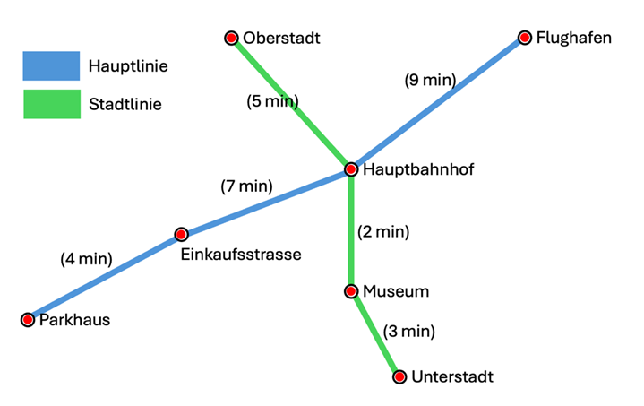

Einleitung
Übersicht
Diese Diplomprüfung besteht aus drei Modulen, die jeweils 100 Minuten dauern: WEB2, PRG2 und DEP. Alle drei Module beziehen sich auf das gleiche Fallbeispiel U-Bahn. Die Module sind so aufgebaut, dass sie unabhängig voneinander geprüft werden. Wer in einem Modul nicht weiterkommt, ist in den anderen Modulen nicht blockiert. Für WEB2 steht bei Bedarf ein Mock-Fallback bereit (siehe WEB2), für DEP eine separate Fallback-Anwendung (siehe DEP).

Fallbeispiel U-Bahn
Eine fiktive Stadt betreibt eine U-Bahn mit zwei Linien. Die Linien teilen sich eine gemeinsame Umsteigestation. Reisende sollen über eine Webanwendung das Streckennetz einsehen und Fahrten zwischen zwei Stationen abfragen können. Mitarbeitende des Betreibers verwalten die Stammdaten der Stationen, Linien und Fahrzeiten.

Streckennetz
Das Streckennetz besteht aus zwei Linien mit insgesamt sieben Stationen. Der Hauptbahnhof verbindet beide Linien.

 

Bezug der Module zum Fallbeispiel
WEB2 entwickelt das Frontend der U-Bahn-Webanwendung mit Vue 3
PRG2 entwickelt die REST-API, die das Frontend mit Daten versorgt, in C# mit MariaDB
DEP deployt die fertige Anwendung als Multi-Container-Setup auf einem Linux-Server (vmLP1)
Virtuelle Lernumgebung
Du arbeitest standardmässig auf den VMs vmWP1 und vmLP1. Grundsätzlich kannst du die Aufgaben auch auf deinem eigenen Gerät umsetzen, die Abgabe selbst findet aber zwingend innerhalb der VM statt (Ausnahme: die Dokumentation). Wenn du ausserhalb der VM entwickelst, bist du dafür verantwortlich, dass alle Abhängigkeiten korrekt vorhanden sind und deine Abgabe rechtzeitig vor Prüfungsende auch auf der VM lauffähig ist.

 

Die Prüfungen werden auf der vmWP1 (Windows 11 Client, für WEB2 und PRG2) und der vmLP1 (Ubuntu Desktop 24.04, nur für DEP) durchgeführt. Auf der vmWP1 sind alle Komponenten installiert, die für WEB2 und PRG2 benötigt werden. Auf der vmLP1 sind die Komponenten für DEP installiert.

Vorbereitete Werkzeuge auf der VM
Bereich	Komponenten
Frontend-Entwicklung	Node.js, npm, Visual Studio Code, Webbrowser
Backend-Entwicklung	Visual Studio Community 2026, Postman, Bruno
Datenbank	MariaDB-Server, Datenbank UBahn vorbereitet
Alle Komponenten laufen lokal auf der VM.
