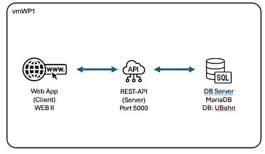

Ausgangslage
Du entwickelst die REST-API der U-Bahn-Plattform. Die API bildet das Backend für zwei Einsatzbereiche: die Abfrage von Streckendaten durch Reisende und die Verwaltung der Stammdaten durch Mitarbeitende des Betreibers.
Die Frontend-Anwendung aus dem Modul WEB verbindet sich mit dieser REST-API, die unter Port 5000 läuft. Die Schnittstelle stellt Linien, Stationen und Fahrzeiten als Ressourcen bereit.
Alle Anforderungen und Mockups vom WEB Modul gelten identisch für das PROG2 Modul!
 

Sprache und Werkzeuge
Die API wird mit C# 14 und .NET 10 entwickelt. Entity Framework wird für den Datenzugriff verwendet.

Die Daten werden persistent in MariaDB gespeichert (Datenbankname «UBahn», Benutzername «admin», Passwort «sml12345» – bereits eingerichtet). 

Die Schnittstelle wird mittels Swagger dokumentiert. 

Den Rest entscheidest du eigenständig: Projektstruktur, Namensgebung der Endpunkte und Fehlerbehandlung. Diese Entscheidungen begründest du in einem kurzen begleitenden Dokument.
 

Architektur:
 

 

Das Streckensystem soll wie folgt abgebildet werden:

 

 

Installierte Komponenten
-    Visual Studio Community 2026 (NuGet Paketquelle bereits konfiguriert, erforderliche Workloads bereits installiert)
-    MariaDB Server, HeidiSQL und mySQL Workbench als Clients
-    Postman und Bruno
-    LibreOffice (für die Dokumentationen)
-    Notepad++
-    7zip

Es dürfen beliebige Programme zusätzlich installiert werden.
 

 Anforderungen
Abfrage-Endpunkte
Streckenabfrage Die API gibt beide Linien mit allen zugehörigen Stationen in der richtigen Reihenfolge zurück.

 

Fahrtabfrage Die API gibt für eine angegebene Start- und Zielstation die Fahrzeit, die Anzahl der Stationen und die Zwischenstationen zurück. Liegen die beiden Stationen nicht auf der gleichen Linie, gibt die API eine entsprechende Meldung zurück. Kein Umsteigen wird unterstützt.

CRUD-Endpunkte
Stationen Eine Liste zeigt alle Stationen. Es ist möglich, neue Stationen anzulegen, bestehende zu bearbeiten und Stationen zu löschen. Pro Station werden Name, zugehörige Linie und Fahrzeit zur vorherigen Station verwaltet.
 

Linien Eine Liste zeigt alle Linien. Es ist möglich, neue Linien anzulegen, bestehende zu bearbeiten und Linien zu löschen.
 

Fahrzeiten Die Fahrzeiten zwischen aufeinanderfolgenden Stationen einer Linie können abgerufen und bearbeitet werden.

 

Abgabe des Endpunkts sowie einer dazugehörigen Dokumentation (Projektstruktur, Namensgebung der Endpunkte und Fehlerbehandlung) als .zip auf smartlearn. Dazu werden Screenshots der abgefüllten Datenbank erstellt mittels smartlearn.

Testen des REST-Servers
Erstellen Sie mit einem geeigneten Hilfsmittel ein Prüfskript, welches die Situation auf der Grafik abbildet und in der Datenbank behält. Zudem soll eine Fahrt vom Parkhaus zum Hauptbahnhof ausgegeben werden mit den Fahrzeiten.
Als Hilfsmittel könnten verwendet werden:
›    curl
›    Fiddler
›    Postman
›    Bruno
›    Skript in Endpoint Explorer von Visual Studio (.http)
›    Weitere, eigene Ansätze
 

Abgabe des Prüfskripts sowie einer dazugehörigen Dokumentation als .zip auf smartlearn.

Bewertung
Bewertungskriterium

mögl. Punkte

Abbilden auf Datenbank (Mapping und Migration) (Screenhot machen!)

10

Objekte und Attribute vollständig, Datentypen korrekt

6

Primär- und Fremdschlüssel sowie Beziehungen korrekt

2

Migration(en) erstellbar und durchgeführt

2

 	 
Datenbankoperationen auf einzelne Elemente (CRUD, LINQ) per REST-API testbar

14

Rückgabe einzelne Elemente nach Primärschlüssel

2

Einfügen einzelne Elemente wenn Daten korrekt

4

Aktualisieren einzelner Elemente wenn Daten OK

4

Löschen einzelner Elemente OK

4

 	
 

Datenbankoperationen auf übergeordneten Elementen per REST-API testbar

10

Platzieren einer neuen Haltestelle auf einer bestehenden Linie als erster oder weitere Haltestelle

2

Definieren der Reisezeit zwischen zwei Stationen

2

Rückgabe der korrekten Angaben (Anzahl Stationen und Reisezeit) zwischen zwei Haltestellen auf der gleichen Linie

1

Rückgabe einer Linie mit allen Haltestellen in korrekter Reihenfolge

1

Dokumentation der REST-API als Swagger Frontend vorhanden

4

 	
 

Testing mittels Tool oder Skript (Dateien in .zip)

16

Ein Testskript für die Erstellung aller Linien ist erstellt

2

Ein Testskript für die Erstellung aller Stationen (auf den Linien) ist erstellt

2

Ein Testskript für die Definition aller Reisezeiten (auf den Linien) ist erstellt

2

Ein Testskript für die Änderung einer Station ist erstellt

1

Ein Testskript für die Löschung einer Station ist erstellt

1

Ein Testskript für das Auslesen der Reisezeit zwischen zwei Stationen ist erstellt

2

Eine schriftliche Dokumentation für das Testing ist erstellt

6

 	
 

TOTAL PUNKTE

50

