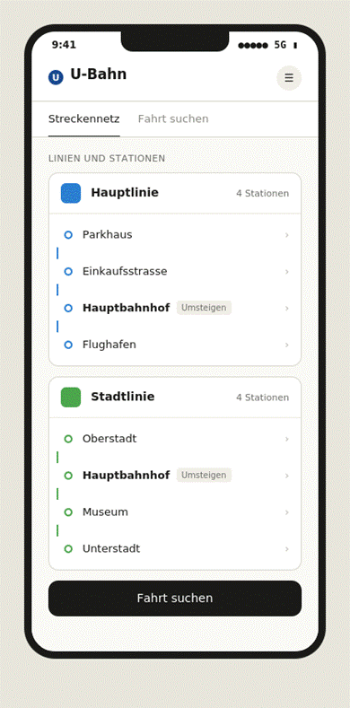
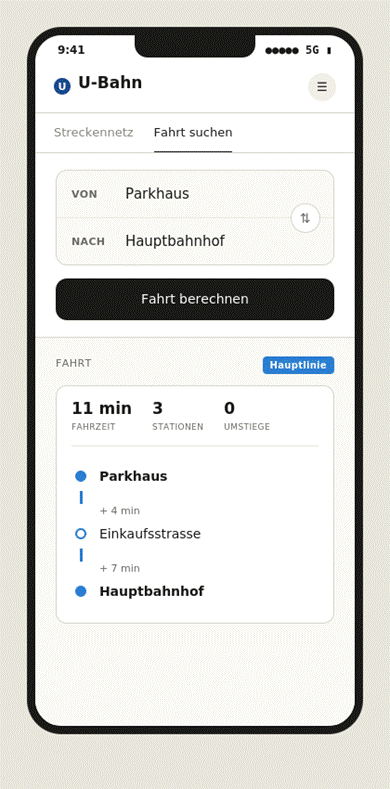
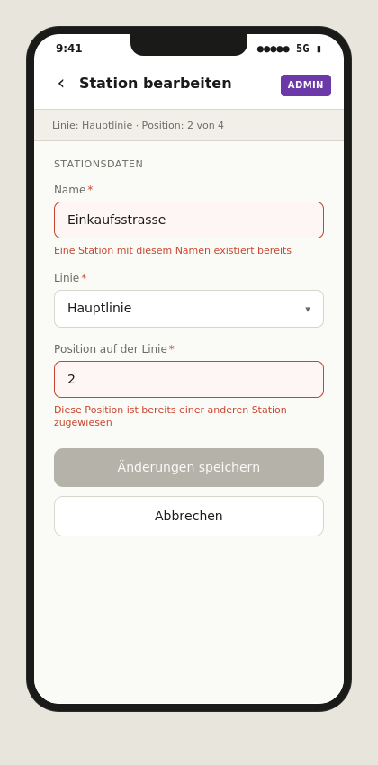

Ausgangslage
Du entwickelst das Webfrontend der U-Bahn-Webanwendung. Die Anwendung hat zwei Bereiche:

 

einen Bereich für Reisende, in dem sie das Streckennetz einsehen und Fahrten abfragen,
…und einen Admin-Bereich, in dem Mitarbeitende des Betreibers die Stammdaten verwalten.
Arbeitsumgebung
Gearbeitet wird auf der virtuellen Maschine vmWP1. Dort sind alle benötigten Werkzeuge vorbereitet. Die Bewertung erfolgt am Ende der Prüfungszeit direkt auf dieser VM. Was dort nicht startet, kann nicht bewertet werden. Du kannst bei Bedarf weitere Tools einfach nachinstallieren.

Schnittstelle zum Backend
Die Anwendung verbindet sich mit der REST-API aus dem Modul PRG2. Die API läuft auf der virtuellen Maschine vmWP1 und stellt Linien, Stationen und Fahrzeiten als Ressourcen bereit.

 

Wichtig: Die REST-API aus PRG2 führt keine Eingabevalidierungen durch. Sämtliche Validierungen sind im Frontend zu implementieren (siehe «Eingabevalidierungen» in den weiteren Kapiteln).

Mock-Fallback
Die WEB2-Prüfung ist auf die Daten aus dem Backend angewiesen, das im SDP-Teil PRG2 entwickelt wird. Solltest du die Anbindung an das Backend nicht oder nur mit Fehlern umsetzen können, kannst du die Backend-Daten im Frontend mocken. Die Wahl der Implementation bleibt dir überlassen, der Entscheid und die Umsetzung müssen aber in der Dokumentation festgehalten werden.

 

Empfehlung zur Umsetzung: Halte die Datenzugriffsschicht (API-Client) auch im Mock-Fall gekapselt, sodass die UI-Komponenten unverändert bleiben. Ein simples Mock-Objekt mit denselben Funktionssignaturen wie der API-Client reicht aus.

Sprache und Werkzeuge
Vorgabe: Die Anwendung wird mit Vue 3 und der Composition API entwickelt. Vue Router wird für die Navigation verwendet. Vite ist das Build-Werkzeug.

 

Den Rest entscheidest du eigenständig: Aufteilung in Komponenten, Verwaltung der Daten und Zustände, Styling. Diese Entscheidungen begründest du in einem kurzen begleitenden Dokument.

 

Die nächsten Kapitel beschreiben, was die Anwendung können muss (Anforderungen) und wie sie sich präsentieren soll (Mockups). Die Bewertung am Ende führt auf, was wie viele Punkte gibt.

Anforderungen
Die Anwendung erfüllt die folgenden Anforderungen. Wie du sie konkret umsetzt, entscheidest du selbst.

Bereich für Reisende
Streckennetz

Reisende sollen das Streckennetz auf einen Blick erfassen können. Beide Linien sind klar voneinander unterscheidbar. Stationen, an denen umgestiegen werden kann, sind als solche erkennbar.

 

Stationen sind interaktiv: ein Klick auf eine Station zeigt zusätzliche Informationen wie Linie, Position oder weiterführende Details an. Die konkrete Form entscheidest du selbst.

 

Fahrt zwischen zwei Stationen

Reisende geben eine Start- und eine Zielstation an. Die Anwendung zeigt, wie lange die Fahrt dauert, wie viele Stationen dazwischenliegen und welche Stationen das sind.

 

Liegen die beiden Stationen nicht auf der gleichen Linie oder sind Start und Ziel identisch, gibt die Anwendung eine verständliche Rückmeldung statt eines leeren Resultats. Umsteigen wird nicht unterstützt.

Admin-Bereich
Der Admin-Bereich ist als solcher erkennbar. Eine Authentifizierung ist nicht erforderlich.

 

Im Admin-Bereich können die Stammdaten verwaltet werden:

Stationen: anlegen, bearbeiten, löschen
Linien: anlegen, bearbeiten, löschen
Fahrzeiten: anlegen, bearbeiten, löschen
Die Reihenfolge der Stationen einer Linie muss verwaltbar sein. Wie das in der Bedienung gelöst wird, entscheidest du.

 

Beim Löschen einer Linie, die noch Stationen enthält, gibt es mehrere mögliche Verhaltensweisen. Welches Verhalten du wählst, entscheidest du und hältst es in der Dokumentation fest.

 

Nach einer Änderung ist die neue Information ohne erneutes Laden der Seite sichtbar.

Eingabevalidierungen
Ausgangslage: Das Backend (PRG2) führt keine Validierungen durch. Sämtliche Validierungen müssen vom Frontend abgedeckt werden, bevor Daten an die REST-API gesendet werden.

 

Die Anwendung deckt mindestens drei verschiedene Validierungsregeln ab. Mögliche Regeln sind beispielsweise:

Pflichtfelder dürfen nicht leer sein
Stationsname muss einer Mindest- und Maximallänge entsprechen
Fahrzeit muss eine positive Ganzzahl in einem plausiblen Bereich sein
Stationsnamen müssen innerhalb einer Linie eindeutig sein
Position einer Station auf einer Linie muss eindeutig sein
Die konkrete Auswahl und die Begründung der gewählten Regeln triffst du selbst und hältst sie in der Dokumentation fest. Mindestens eine Regel wählst du eigenständig, sie muss nicht aus der obigen Liste stammen.

 

Bei einer ungültigen Eingabe wird das Speichern verhindert (der entsprechende Button ist deaktiviert) und es erscheint eine Rückmeldung direkt am betroffenen Feld.

Mockups
Drei Views zeigen, wie die wichtigsten Ansichten in der Mobile-Variante aussehen sollen. Inhalt und ungefähres Layout sind verbindlich. Farben, Schriften und konkrete Komponenten-Stile bestimmst du selbst und ziehst sie konsistent durch.

 

Für die Desktop-View gibt es keine Mockups. Sie ist eigenständig zu gestalten und nutzt den verfügbaren Platz sinnvoll, anstatt nur die Mobile-Ansicht zu strecken.

Streckennetz-Ansicht

Übersicht mit Hauptlinie und Stadtlinie. Stationen, an denen umgestiegen werden kann, sind hervorgehoben

Fahrtabfrage

Eingabe von Start und Ziel mit dem Resultat darunter. Das Resultat zeigt Fahrzeit, Anzahl Stationen und Zwischenstationen

Admin: Station bearbeiten

Formular zum Bearbeiten einer Station. Zwei Felder enthalten ungültige Eingaben und zeigen Validierungsfehler. Das Speichern ist deaktiviert. Die Mockups zeigen das visuelle Verhalten bei Validierungsfehlern, die konkreten Regeln entscheidest du

Bewertung
Total 50 Punkte, gegliedert nach Produkt, Prozess und Präsentation.

Kriterium	Punkte	Erreicht
A. Anwendung läuft	
3

 
Frontend startet ohne Fehler	
1

 
Anwendung kommuniziert mit der REST-API und zeigt Daten an	
2

 
B. Streckennetz-Ansicht	
6

 
Übersicht zeigt beide Linien mit allen zugehörigen Stationen in der richtigen Reihenfolge	
2

 
Die zwei Linien sind farblich oder visuell klar unterschieden	
1

 
Umsteigestation Hauptbahnhof ist als solche erkennbar markiert	
1

 
Klick auf eine Station führt zu einer Detailansicht oder zeigt zusätzliche Informationen	
2

 
C. Fahrtabfrage	
7

 
Eingabe von Startstation und Zielstation ist möglich	
2

 
Resultat zeigt die Fahrzeit, die Anzahl Stationen und die Zwischenstationen	
2

 
Wenn Start- und Zielstation nicht auf der gleichen Linie liegen, erscheint eine verständliche Meldung statt eines leeren Resultats	
2

 
Wenn Start- und Zielstation identisch sind, erscheint eine entsprechende Meldung	
1

 
D. Admin-Bereich (CRUD)	
8

 
Admin-Bereich ist als solcher erkennbar	
1

 
Liste aller Stationen mit Möglichkeit, Stationen anzulegen, zu bearbeiten und zu löschen	
2

 
Liste aller Linien mit Möglichkeit, Linien anzulegen, zu bearbeiten und zu löschen	
2

 
Fahrzeiten zwischen Stationen können angelegt, bearbeitet und gelöscht werden	
2

 
Nach einer Änderung ist die neue Information ohne erneutes Laden der Seite sichtbar	
1

 
E. Frontend-Validierungen	
6

 
Mindestens drei unterschiedliche Validierungsregeln sind umgesetzt	
2

 
Bei ungültiger Eingabe ist das Speichern deaktiviert und eine Fehlermeldung erscheint am betroffenen Feld	
2

 
Die gewählten Regeln sind in der Dokumentation aufgeführt	
1

 
Die Begründung für jede Regel zeigt, warum sie für diesen Anwendungsfall sinnvoll ist	
1

 
F. Aufbau im Code	
6

 
Sinnvolle Aufteilung in mehrere Komponenten und Ansichten	
2

 
Logik für API-Aufrufe ist von der Darstellung getrennt	
2

 
Daten und Zustände sind an nachvollziehbarer Stelle gebündelt	
1

 
Lesbarer Code, konsistente Benennung, keine toten Fragmente	
1

 
G. Begleitendes Dokument	
5

 
Dokument erklärt nachvollziehbar, wie die Anwendung aufgebaut ist	
2

 
Begründungen für Architekturentscheidungen sind enthalten	
1

 
Beschreibungen passen zum tatsächlichen Code	
1

 
Offene Punkte und Einschränkungen sind ehrlich benannt	
1

 
H. Gestaltung und visuelle Sorgfalt	
9

 
Eigene Farb- und Schriftwahl, durchgängig konsistent	
1

 
Komponenten sind visuell einheitlich gestaltet (Buttons, Eingaben, Karten)	
2

 
Abstände, Ausrichtung und Hierarchie sind durchdacht und konsequent	
2

 
Anwendung ist auf Desktop und Mobile bedienbar	
1

 
Desktop-Ansicht nutzt den Platz sinnvoll, ist nicht nur die Mobile-Ansicht gestreckt	
1

 
Sichtbarer Fokus-Indikator auf interaktiven Elementen	
1

 
Wirkt fertig und gepflegt, nicht wie ein unfertiger Prototyp	
1

 
Total	
50

 

